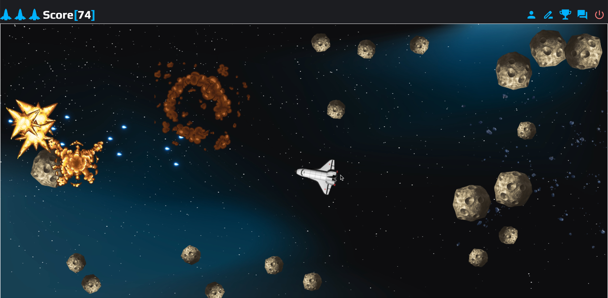

# 🚀 Auckland Team presents 'Destroy Asteroids' game!

Awesome web version of the classic Atari game on JS




Stack: NodeJS, PostgresDB, TypeScript, ReactJS, Sass, Redux&Saga, Webpack, Docker, GitHub Actions

### To play

https://asteroidsdestroy.ru/

1. Use **arrow buttons** to move and **space button** to shoot
2. To toggle **Fullscreen mode** just click on game screen.
3. You can choose **Russian** or **English** language (by default it based on your browser settings)
4. To save you **score**, view the **high-scores** and use game **forum** you may like to register


### To develop

```
npm run build - production
npm run dev - dev server (w/o db connect)
```

For Docker-compose build
```
docker-compose down -v
docker-compose up -d --build
    
```
To Check the build
```
docker-compose ps
```
To use dev DB try PG admin on localhost:8097 and create DB
```
- PGADMIN_DEFAULT_EMAIL: admin@asteroidsdestroy.com
  PGADMIN_DEFAULT_PASSWORD: (asterdest65457(
- right click -> create -> server
- general -> name: postgres
- connection -> host name: postgres
                username: POSTGRES_USER store it in .env
                password: POSTGRES_PASSWORD store it in .env
                rest is by default
```

